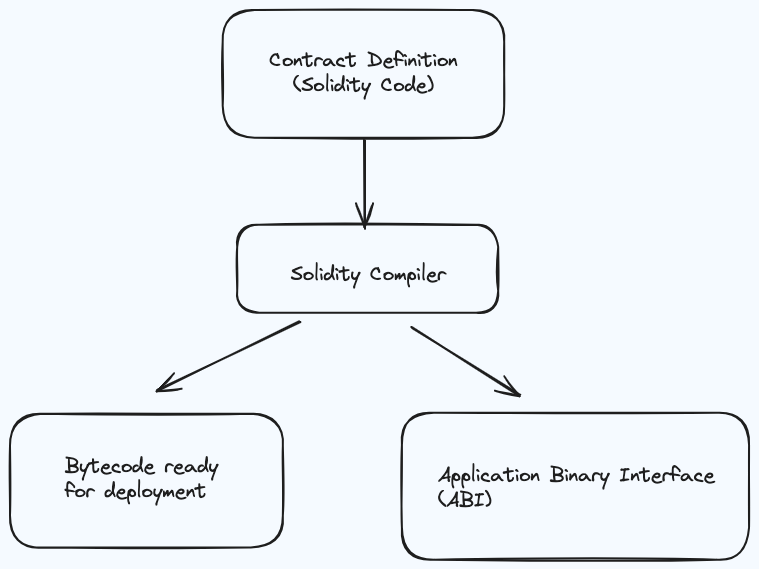

Web3.js: is a framework that developers write in server side to interact with Ethereum network
Metamask: is a tool for customer can do transaction with their wallet in Ether network
Ethereum network: like a container, has blocks which are linked to each other inside of it

Metamask account:

- Metamask account can be the same in various Ethereum network (main, sepolia, ropsten, ...)

Transaction?

- Is a record to store the action: money is moved from an account to other accounts
- Transaction happen whenever account has some money exchanges
- some special term:
  - nonce: how many times the sender has sent a transaction
  - to: Address of account that money will be sent to
  - value: Amount of ether will be sent to target address
  - gasPrice: Amount of ether that sender willing to pay per unit of gas to get transaction processed
  - startGas/gasLimit: Units of gas that this transaction can consume
  - v, r, s: Cryptographic pieces of data that can be used to generate the senders account address. Generated from sender private key.

Why we have to wait so long for Ether nerwork can confirm transaction?

- Because, logic to handle inside Ether network is seriously complex
- Has many peer, a peer has many nodes/blocks
- Each block have to find a hash to hash info about transaction (mining)
- After block mines or hashed a transaction, the next block will remine to store previous hash is new hash of previous blocks, sequential like that to the end block

more visualize. Pls visit: [blockchain demo](https://andersbrownworth.com/blockchain/blockchain)

Solidity:

- Bytecode ready for deployment: source code/ contract (in bytecode) will be deployed in Ether network
- ABI: in upstream side like frontend/mobile, it can not interact directly with bytecode, so it have to interact with middle layer is ABI to interact with contract in Ether network

Gas: 
- Cost to run the contract
- every time we make a transaction in ethereum network, we pay gas to execute that code
- Each operation like add, subtract or divide will take a specific amount of gas [gas cost from yellow paper](https://wiki.learnblockchain.cn/OPCODE_Gas.pdf)

- ex: more nested loop, more gas will be consumed

truffle: 
- is a kind of a one stop shop for development of Ethereum contracts

some cons:
- Undergoing rapid development
- Some things don't work well, at all
- Stuff break - Some patience is required